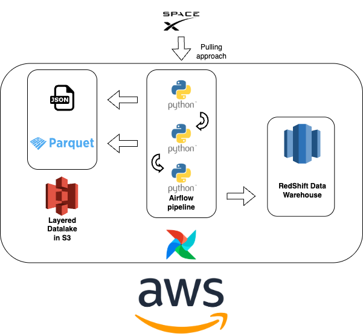

# 🚀 seQura  data engineering challenge

AWS Data Platform Architecture for SpaceX Launch Data. This architecture focuses on building a scalable 
and robust data platform on AWS, leveraging services for data ingestion, storage, processing, and consumption.

## 1. Data Infrastructure on AWS
### Architectural Diagram Description



* Data Source: SpaceX API (JSON Data): The primary data source. This is where the raw JSON dataset about SpaceX launches originates.
* Ingestion layer: Airflow (on Kubernetes or self managed): This acts as the orchestration engine.
  * Airflow: Can be hosted on Amazon self managed instances or within an Amazon EKS cluster for containerized deployments. It will schedule and manage the ETL pipelines.
* Data Ingestion Script/Tool (Python/Airbyte): This is the component that actually fetches the data from the SpaceX API. 
  It could be a custom Python script or an Airbyte connector. This script will run as part of an Airflow DAG.
* Data Storage Layers: 
  * Raw: Ingested JSON files are stored here as-is. This provides a durable, highly available, and cost-effective storage for raw, immutable data. It serves as the single source of truth for all historical raw data.
  * Validated: Can read data from S3, perform transformations (e.g., flatten nested JSON, clean data types, handle missing values), and write the processed data back to S3 in a columnar format (parquet).
* Data Warehousing Layer in Amazon RedShift:
  * The processed data from the S3 data lake is loaded into Redshift tables for high-performance analytical querying. Redshift is ideal for complex joins and aggregations over large datasets.
* Data Consumption/Analytics Layer:
  * Connect to Amazon Redshift to visualize data, create dashboards, and generate reports.
---

### Security and access control
Implementing robust security and access control is paramount for any cloud data platform. 
The key point here is to have at least two environments, development and production.
In production everything should be automated via CI/CD so no users should have more than read permission in production.

Here's how it would be handled in this architecture related with permissions between services and users:
1. IAM (Identity and Access Management): Principle of Least Privilege. Each AWS service interacting with others will be assigned a specific IAM Role with only the necessary permissions required for its function. The same concept apply for regular users. 
   2. Example: Redshift Cluster needs permissions to read from S3 validated bucket (for COPY commands) and potentially write logs to CloudWatch.
2. Roles:
   3. Administrators: Full access (or highly restricted access) to manage AWS resources. 
   4. Data Engineers: Access to manage ETL jobs, S3 buckets, and Redshift cluster (but not necessarily data). 
   5. Data Analysts/Scientists: Read-only access to Redshift data (via redshift-data-api or direct connection) and potentially read access to S3 processed data.

---

### Virtual Network
A dedicated Virtual Private Cloud (VPC) will be deployed for all AWS resources like Redshift cluster or EKS cluster.
#### Key Components
* Subnets: A resource is placed within a subnet group, which contains one or more subnets in a VPC (usually one per Availability Zone for high availability).
* Security Groups: These act as virtual firewalls. You configure inbound/outbound rules to control access to the service (e.g., allowing only specific IPs or EC2 instances to connect).
* Network Access Control Lists (NACLs): Stateless packet filtering at the subnet level to control traffic in and out.
* Security Groups: Stateful firewall rules applied to individual instances/interfaces.
* VPC Endpoints: Use VPC Endpoints for S3 and other AWS services to keep traffic within the AWS network, improving security and reducing data transfer costs.

---

## 2. Orchestration and Container Management with Kubernetes
* Describe the steps to deploy a Kubernetes cluster containing an orchestrator and database and the ingestion script/tool containers.

First of all, i'll install eksctl cli. Using the cli, you can create a cluster in EKS. After that, you can use `helm` cli to install
apache airflow in the cluster and postgredb database. And finally, push the docker images created with the etl code into Amazon Elastic Container Registry and configure jobs in eks.

* Describe how you would configure monitoring and logging for the Kubernetes cluster using tools like Prometheus or Grafana.

Regarding this part i can use the architecture knowledge i have in Azure so you can install grafana and use Amazon CloudWatchLogs to connect both services and create dashboards.

---

## 3. ETL Pipeline
* Provide a tool/script that extracts data from the provided JSON file, transforms the data by applying some cleaning or aggregation, and loads it into the database.
  * code is inside `etl` folder
* Explain how you would schedule and monitor this pipeline using tools like Apache Airflow.

Pipelines in Airflow are defined as DAGs (Directed Acyclic Graphs), using Python code. Check out `etl/dag.py` file.

Airflow provides a web UI for visual monitoring, you can see DAG view, tree view, visualize dependencies, times, logs...
Airflow can also retry tasks automatically on failure (configurable per task)
Regarding alerts, you can configure it using `on_failure_callback`. Regarding logs, airflow can store logs in S3 for further analysis.

---

## 4. SQL Queries
* Write an SQL query to find the maximum number of times a core has been reused.
* Write an SQL query to find the cores that have been reused in less than 50 days after the previous launch.

Both queries are placed inside file `redshift_queries.sql`

---

## 📦 Dependencies

All project dependencies are listed in:

- `pyproject.toml` — main dependency and metadata configuration
- `uv.lock` — exact versions for reproducible installs

---

## 🛠 Getting Started
There are two ways to get started, building a local environment in your laptop or building the dockerfile and develop in the container.
Let's explain the first method

### 1. Clone the repository

```bash
git clone https://github.com/davidRetana/sequra-de-challenge.git
cd sequra-de-challenge
```

### 2. Install uv
This project uses [uv](https://github.com/astral-sh/uv), a super-fast Python package manager, along with `pyproject.toml` and `uv.lock` for dependency management and reproducibility.

https://docs.astral.sh/uv/getting-started/installation/
```bash
curl -LsSf https://astral.sh/uv/install.sh | sh
```

### 3. Create a virtual environment
```bash
uv venv --python 3.9
source .venv/bin/activate   # On Windows: .venv\Scripts\activate
```

### 4. Installing Dependencies
From Lockfile (Recommended for Consistency)
```bash
uv pip install --frozen
```
Command to create uv.lock
```bash
uv pip compile pyproject.toml > uv.lock
```

Add a new package
```bash
uv pip install <package>
```

### 5. Running the Project
```bash
python etl/extract_raw_data.py
```
